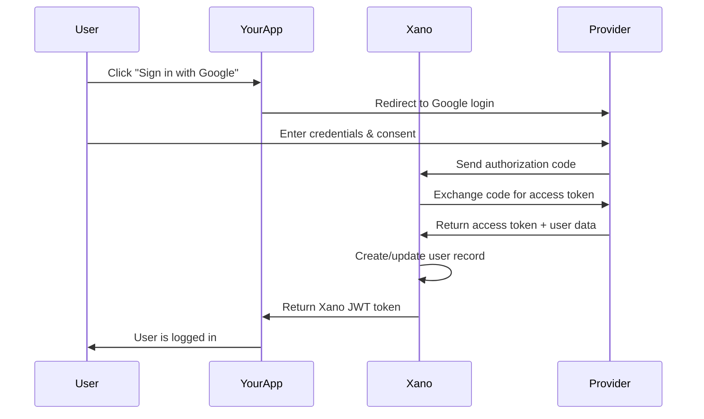

# OAuth & Single Sign-On (SSO) in Xano

## 📋 **Quick Summary**

**What it does:** OAuth (Open Authorization) enables users to sign into your application using existing accounts from providers like Google, Facebook, or GitHub without creating new passwords or sharing credentials.

**Why it matters:** OAuth and SSO provide:
- **Better user experience** - No new accounts to create or passwords to remember
- **Enhanced security** - Leverage proven authentication systems from major providers
- **Faster onboarding** - Users can sign up and start using your app immediately
- **Reduced support burden** - Fewer password reset requests and login issues

**Time to implement:** 30-60 minutes per OAuth provider, 2-3 hours for complete multi-provider setup

---

## What You'll Learn

- OAuth vs traditional authentication and when to use each
- Complete OAuth flow implementation in Xano
- Setting up popular providers (Google, Facebook, GitHub)
- Frontend integration patterns for no-code tools
- Advanced security considerations and best practices
- Troubleshooting common OAuth implementation issues

## Understanding OAuth & SSO

Think of OAuth like a hotel key card system - instead of giving someone your house key, the hotel gives you a temporary card that only works for your room and only during your stay. OAuth works similarly by giving apps limited, temporary access to your data without sharing your actual password.

### 🎯 **OAuth vs Traditional Authentication**

| Aspect | Traditional Auth | OAuth/SSO |
|--------|-----------------|-----------|
| **User Experience** | Create new account | Use existing account |
| **Password Management** | User manages password | Provider handles security |
| **Setup Complexity** | Simple | Moderate setup, easier maintenance |
| **Security** | Depends on implementation | Leverages provider security |
| **Trust** | Users must trust your app | Users trust familiar providers |

### 🔐 **OAuth vs JWE Token Authentication**

**OAuth** is like having a **trusted intermediary** (Google, Facebook) vouch for the user's identity:
- User authenticates with a provider they trust
- Provider confirms identity to your application
- Great for user onboarding and reducing friction
- Handles authentication, not just data transmission

**JWE Token Authentication** is like a **sealed, encrypted envelope**:
- Data is encrypted and can only be read by intended recipient
- Ensures data privacy and integrity during transmission
- Used after authentication to secure API communication
- Handles secure data exchange, not user identity verification

💡 **In Practice:** Most applications use OAuth for initial login, then switch to JWE tokens for ongoing API communication.

## The OAuth Flow Explained

### Step-by-Step OAuth Process



### 1. **Client Registration**
Your application registers with the OAuth provider to get:
- **Client ID**: Public identifier for your app
- **Client Secret**: Private key for secure communication
- **Redirect URL**: Where users return after authentication

### 2. **User Authorization**
User clicks "Sign in with Google/Facebook" and gets redirected to:
- Provider's login page
- Permission consent screen
- Approval for data access

### 3. **Authorization Grant**
Provider sends back an authorization code via URL parameter:
```
https://yourapp.com/oauth/callback?code=abc123&state=xyz789
```

### 4. **Access Token Exchange**
Your Xano API exchanges the code for tokens:
```json
{
  "access_token": "ya29.a0ARrdaM...",
  "refresh_token": "1//04...",
  "expires_in": 3600,
  "token_type": "Bearer"
}
```

### 5. **User Data Retrieval**
Use access token to get user information:
```json
{
  "id": "1234567890",
  "name": "John Doe",
  "email": "john@example.com",
  "picture": "https://photo.url"
}
```

### 6. **Xano Authentication**
Create/update user record and return Xano JWT for your app.

## Setting Up OAuth in Xano

### Step 1: Enable Marketplace Access

If you don't see **Marketplace** in your navigation:

1. Go to **Workspace Settings** (gear icon in top-right)
2. Check **Enable Marketplace**
3. Save settings

### Step 2: Browse OAuth Extensions

Xano provides prebuilt OAuth flows for popular providers:

- **Google OAuth** - Most common, reliable
- **Facebook OAuth** - Social media integration
- **GitHub OAuth** - Developer-focused applications
- **Apple OAuth** - iOS and privacy-conscious users
- **Microsoft OAuth** - Enterprise integrations
- **Twitter/X OAuth** - Social media authentication

### Step 3: Import OAuth Extension

1. Navigate to **Marketplace**
2. Search for your desired OAuth provider
3. Click **Install** to add to your workspace
4. Review the imported API endpoints and database tables

### Step 4: Configure Provider Settings

Each OAuth provider requires specific configuration:

## Google OAuth Setup

### 1. Google Cloud Console Configuration

```yaml
Steps:
1. Go to Google Cloud Console (console.cloud.google.com)
2. Create a new project or select existing
3. Enable Google+ API and Gmail API
4. Go to Credentials → Create OAuth 2.0 Client ID
5. Set redirect URI: https://[instance].xano.io/api/oauth/google/callback
```

### 2. Xano Configuration

```javascript
// Environment variables to set in Xano
GOOGLE_CLIENT_ID=your_google_client_id
GOOGLE_CLIENT_SECRET=your_google_client_secret
GOOGLE_REDIRECT_URI=https://[instance].xano.io/api/oauth/google/callback
```

### 3. Frontend Integration Example

```javascript
// Frontend: Initiate Google OAuth
function loginWithGoogle() {
  const googleAuthUrl = `https://accounts.google.com/oauth/authorize?` +
    `client_id=${GOOGLE_CLIENT_ID}&` +
    `redirect_uri=${encodeURIComponent(REDIRECT_URI)}&` +
    `scope=openid%20profile%20email&` +
    `response_type=code&` +
    `state=${generateRandomState()}`;
  
  window.location.href = googleAuthUrl;
}

// Handle callback and get Xano token
async function handleGoogleCallback(code, state) {
  const response = await fetch('https://[instance].xano.io/api/oauth/google', {
    method: 'POST',
    headers: { 'Content-Type': 'application/json' },
    body: JSON.stringify({ code, state })
  });
  
  const data = await response.json();
  localStorage.setItem('xano_token', data.authToken);
  
  return data.user;
}
```

## Facebook OAuth Setup

### 1. Facebook App Configuration

```yaml
Steps:
1. Go to developers.facebook.com
2. Create a new app or use existing
3. Add Facebook Login product
4. Set Valid OAuth Redirect URIs: 
   https://[instance].xano.io/api/oauth/facebook/callback
5. Get App ID and App Secret
```

### 2. Xano Environment Variables

```javascript
FACEBOOK_APP_ID=your_facebook_app_id
FACEBOOK_APP_SECRET=your_facebook_app_secret
FACEBOOK_REDIRECT_URI=https://[instance].xano.io/api/oauth/facebook/callback
```

### 3. Frontend Implementation

```javascript
// Facebook OAuth initiation
function loginWithFacebook() {
  const facebookAuthUrl = `https://www.facebook.com/v18.0/dialog/oauth?` +
    `client_id=${FACEBOOK_APP_ID}&` +
    `redirect_uri=${encodeURIComponent(FACEBOOK_REDIRECT_URI)}&` +
    `scope=email,public_profile&` +
    `response_type=code&` +
    `state=${generateRandomState()}`;
  
  window.location.href = facebookAuthUrl;
}
```

## GitHub OAuth Setup

### 1. GitHub App Configuration

```yaml
Steps:
1. Go to GitHub Settings → Developer settings
2. Click OAuth Apps → New OAuth App
3. Set Authorization callback URL:
   https://[instance].xano.io/api/oauth/github/callback
4. Get Client ID and Client Secret
```

### 2. Environment Configuration

```javascript
GITHUB_CLIENT_ID=your_github_client_id
GITHUB_CLIENT_SECRET=your_github_client_secret
GITHUB_REDIRECT_URI=https://[instance].xano.io/api/oauth/github/callback
```

## No-Code Platform Integration

### 🔗 **n8n OAuth Workflow**

```yaml
OAuth Integration Workflow:
1. Webhook Trigger (OAuth callback)
2. Function Node (Extract authorization code)
3. HTTP Request (Exchange code for token at Xano)
4. Conditional (Check authentication success)
5. Set Variables (Store user data)
6. HTTP Response (Redirect user to app)
```

**n8n OAuth Handler Example:**
```javascript
// Process OAuth callback
const authCode = $input.query.code;
const state = $input.query.state;

if (!authCode) {
  return { error: 'Authorization code missing' };
}

// Exchange code for Xano token
const xanoResponse = await $request({
  method: 'POST',
  url: 'https://[instance].xano.io/api/oauth/google',
  data: { code: authCode, state: state },
  headers: { 'Content-Type': 'application/json' }
});

return {
  success: true,
  authToken: xanoResponse.data.authToken,
  user: xanoResponse.data.user
};
```

### 🌐 **WeWeb OAuth Integration**

```javascript
// WeWeb OAuth authentication flow
class WeWebOAuth {
  constructor() {
    this.providers = {
      google: {
        clientId: wwLib.envVars.GOOGLE_CLIENT_ID,
        scope: 'openid profile email'
      },
      facebook: {
        clientId: wwLib.envVars.FACEBOOK_APP_ID,
        scope: 'email,public_profile'
      }
    };
  }
  
  async initiateOAuth(provider) {
    const config = this.providers[provider];
    if (!config) throw new Error(`Provider ${provider} not supported`);
    
    const authUrl = this.buildAuthUrl(provider, config);
    window.location.href = authUrl;
  }
  
  buildAuthUrl(provider, config) {
    const baseUrls = {
      google: 'https://accounts.google.com/oauth/authorize',
      facebook: 'https://www.facebook.com/v18.0/dialog/oauth'
    };
    
    const params = new URLSearchParams({
      client_id: config.clientId,
      redirect_uri: `${window.location.origin}/oauth/${provider}/callback`,
      scope: config.scope,
      response_type: 'code',
      state: this.generateState()
    });
    
    return `${baseUrls[provider]}?${params}`;
  }
  
  async handleCallback(provider, code, state) {
    // Verify state parameter
    if (!this.verifyState(state)) {
      throw new Error('Invalid state parameter');
    }
    
    // Exchange code for Xano token
    const response = await wwLib.api.post({
      url: `${wwLib.envVars.XANO_API}/oauth/${provider}`,
      data: { code, state },
      headers: { 'Content-Type': 'application/json' }
    });
    
    // Store authentication data
    wwLib.auth.setAuthToken(response.data.authToken);
    wwLib.user.setUserData(response.data.user);
    
    // Redirect to app
    wwLib.goTo('/dashboard');
    
    return response.data;
  }
  
  generateState() {
    return Math.random().toString(36).substring(2, 15);
  }
  
  verifyState(state) {
    // Implement state verification logic
    return sessionStorage.getItem('oauth_state') === state;
  }
}

// Usage in WeWeb
const oauth = new WeWebOAuth();

// Login button actions
function loginWithGoogle() {
  oauth.initiateOAuth('google');
}

function loginWithFacebook() {
  oauth.initiateOAuth('facebook');
}
```

### 🔧 **Make OAuth Automation**

```yaml
OAuth Processing Scenario:
1. Webhook (OAuth provider callback)
2. JSON Parser (Extract callback data)
3. HTTP Request (Call Xano OAuth endpoint)
4. Router (Handle success/error responses)
5. Data Store (Update user records)
6. Email (Send welcome message)
```

## Advanced OAuth Patterns

### Pattern 1: Multi-Provider Authentication

```javascript
class MultiProviderOAuth {
  constructor() {
    this.providers = ['google', 'facebook', 'github', 'apple'];
    this.userMerging = true; // Enable account linking
  }
  
  async authenticateUser(provider, authData) {
    try {
      // 1. Get user data from provider
      const providerUser = await this.getProviderUserData(provider, authData);
      
      // 2. Check for existing user by email
      const existingUser = await this.findUserByEmail(providerUser.email);
      
      if (existingUser) {
        // 3. Link new provider to existing account
        await this.linkProviderToUser(existingUser.id, provider, providerUser);
        return this.generateAuthToken(existingUser);
      } else {
        // 4. Create new user with provider data
        const newUser = await this.createUserFromProvider(provider, providerUser);
        return this.generateAuthToken(newUser);
      }
      
    } catch (error) {
      throw new Error(`OAuth authentication failed: ${error.message}`);
    }
  }
  
  async linkProviderToUser(userId, provider, providerData) {
    // Store provider-specific data
    await this.updateUserRecord(userId, {
      [`${provider}_id`]: providerData.id,
      [`${provider}_data`]: JSON.stringify(providerData),
      [`${provider}_linked_at`]: new Date().toISOString()
    });
  }
  
  async createUserFromProvider(provider, providerData) {
    const userData = {
      email: providerData.email,
      name: providerData.name,
      avatar: providerData.picture || providerData.avatar_url,
      email_verified: true, // OAuth providers verify emails
      auth_provider: provider,
      [`${provider}_id`]: providerData.id,
      created_at: new Date().toISOString()
    };
    
    return await this.createUser(userData);
  }
}
```

### Pattern 2: JWT Integration with OAuth

```javascript
// After successful OAuth, generate application-specific JWT
function generateXanoAuthToken(user, oauthProvider) {
  const tokenPayload = {
    user_id: user.id,
    email: user.email,
    name: user.name,
    auth_method: 'oauth',
    oauth_provider: oauthProvider,
    permissions: user.role_permissions,
    issued_at: Math.floor(Date.now() / 1000),
    expires_at: Math.floor(Date.now() / 1000) + (24 * 60 * 60) // 24 hours
  };
  
  // Use Xano's built-in JWT generation
  return generateJWT(tokenPayload, process.env.JWT_SECRET);
}

// Middleware to validate OAuth-generated tokens
function validateOAuthToken(request) {
  const token = extractTokenFromRequest(request);
  
  if (!token) {
    throw new Error('Authentication token required');
  }
  
  const decoded = verifyJWT(token, process.env.JWT_SECRET);
  
  if (decoded.auth_method !== 'oauth') {
    throw new Error('Token not generated from OAuth flow');
  }
  
  if (decoded.expires_at < Math.floor(Date.now() / 1000)) {
    throw new Error('Token has expired');
  }
  
  return decoded;
}
```

### Pattern 3: Enhanced Security Features

```javascript
class SecureOAuth {
  constructor() {
    this.rateLimit = new Map(); // Simple rate limiting
    this.suspiciousActivity = new Map();
  }
  
  async secureAuthentication(provider, authData, clientInfo) {
    // 1. Rate limiting
    this.enforceRateLimit(clientInfo.ip);
    
    // 2. CSRF protection via state parameter
    this.validateStateParameter(authData.state, authData.sessionId);
    
    // 3. Provider token validation
    const providerUser = await this.validateProviderToken(provider, authData);
    
    // 4. Risk assessment
    const riskScore = this.assessAuthenticationRisk(providerUser, clientInfo);
    
    if (riskScore > 0.8) {
      // High risk - require additional verification
      await this.requireAdditionalVerification(providerUser.email);
      throw new Error('Additional verification required');
    }
    
    // 5. Successful authentication
    return await this.completeAuthentication(providerUser, provider);
  }
  
  enforceRateLimit(ip) {
    const now = Date.now();
    const attempts = this.rateLimit.get(ip) || [];
    
    // Remove attempts older than 1 hour
    const recentAttempts = attempts.filter(time => now - time < 60 * 60 * 1000);
    
    if (recentAttempts.length >= 10) {
      throw new Error('Too many authentication attempts');
    }
    
    recentAttempts.push(now);
    this.rateLimit.set(ip, recentAttempts);
  }
  
  validateStateParameter(providedState, sessionState) {
    if (!providedState || providedState !== sessionState) {
      throw new Error('Invalid state parameter - possible CSRF attack');
    }
  }
  
  assessAuthenticationRisk(user, clientInfo) {
    let risk = 0;
    
    // New account
    if (!user.lastLogin) risk += 0.2;
    
    // Unusual location
    if (this.isUnusualLocation(user.id, clientInfo.ip)) risk += 0.3;
    
    // Suspicious timing
    if (this.isSuspiciousTiming(user.id)) risk += 0.2;
    
    // Provider-specific risks
    if (this.hasProviderRiskIndicators(user)) risk += 0.3;
    
    return Math.min(risk, 1.0);
  }
}
```

## Security Best Practices

### 1. State Parameter for CSRF Protection

```javascript
// Always use and validate state parameter
function generateSecureState() {
  const state = crypto.randomBytes(32).toString('hex');
  sessionStorage.setItem('oauth_state', state);
  return state;
}

function validateState(returnedState) {
  const originalState = sessionStorage.getItem('oauth_state');
  sessionStorage.removeItem('oauth_state');
  
  if (originalState !== returnedState) {
    throw new Error('CSRF attack detected');
  }
}
```

### 2. Secure Token Storage

```javascript
// Secure token handling
class SecureTokenStorage {
  static store(token) {
    // Use httpOnly cookies for maximum security
    document.cookie = `auth_token=${token}; HttpOnly; Secure; SameSite=Strict; Max-Age=86400`;
    
    // Or use secure localStorage with encryption
    const encrypted = this.encrypt(token);
    localStorage.setItem('auth_token_encrypted', encrypted);
  }
  
  static retrieve() {
    // Decrypt if using localStorage
    const encrypted = localStorage.getItem('auth_token_encrypted');
    return encrypted ? this.decrypt(encrypted) : null;
  }
  
  static clear() {
    document.cookie = 'auth_token=; Max-Age=0';
    localStorage.removeItem('auth_token_encrypted');
  }
}
```

### 3. Scope Management

```javascript
// Request minimal necessary scopes
const providerScopes = {
  google: 'openid email profile', // Minimal Google scopes
  facebook: 'email,public_profile', // Basic Facebook info
  github: 'user:email', // Just email from GitHub
  apple: 'name email' // Basic Apple ID info
};

// Validate received data matches requested scopes
function validateReceivedData(provider, userData) {
  const allowedFields = {
    google: ['id', 'email', 'name', 'picture', 'email_verified'],
    facebook: ['id', 'email', 'name', 'picture'],
    github: ['id', 'email', 'login', 'name', 'avatar_url'],
    apple: ['sub', 'email', 'name', 'email_verified']
  };
  
  const allowed = allowedFields[provider];
  const received = Object.keys(userData);
  
  // Check for unexpected data
  const unexpected = received.filter(field => !allowed.includes(field));
  if (unexpected.length > 0) {
    console.warn(`Unexpected OAuth data received: ${unexpected.join(', ')}`);
  }
}
```

## Error Handling & Troubleshooting

### Common OAuth Errors

| Error | Cause | Solution |
|-------|-------|----------|
| `redirect_uri_mismatch` | URL doesn't match registered | Update OAuth app settings |
| `invalid_client` | Wrong Client ID/Secret | Verify credentials |
| `access_denied` | User cancelled login | Handle gracefully, show retry |
| `invalid_grant` | Expired/invalid auth code | Restart OAuth flow |
| `insufficient_scope` | Missing permissions | Request additional scopes |

### Robust Error Handling

```javascript
class OAuthErrorHandler {
  static async handleCallback(searchParams) {
    try {
      // Check for error parameter
      if (searchParams.has('error')) {
        const error = searchParams.get('error');
        const description = searchParams.get('error_description');
        
        return this.handleOAuthError(error, description);
      }
      
      // Extract and validate code
      const code = searchParams.get('code');
      const state = searchParams.get('state');
      
      if (!code) {
        throw new Error('Authorization code missing');
      }
      
      // Process successful callback
      return await this.processAuthCode(code, state);
      
    } catch (error) {
      console.error('OAuth callback failed:', error);
      return this.showUserFriendlyError(error);
    }
  }
  
  static handleOAuthError(error, description) {
    const userMessages = {
      'access_denied': 'You cancelled the login. Click here to try again.',
      'invalid_request': 'There was a problem with the login request. Please try again.',
      'server_error': 'The login service is temporarily unavailable. Please try again later.',
      'temporarily_unavailable': 'Login is temporarily unavailable. Please try again in a few minutes.'
    };
    
    const userMessage = userMessages[error] || 'Login failed. Please try again.';
    
    return {
      success: false,
      error: error,
      userMessage: userMessage,
      technical: description
    };
  }
  
  static showUserFriendlyError(error) {
    // Show appropriate error message to user
    const errorDiv = document.createElement('div');
    errorDiv.className = 'oauth-error';
    errorDiv.innerHTML = `
      <h3>Login Failed</h3>
      <p>We couldn't sign you in. Please try again.</p>
      <button onclick="retryLogin()">Try Again</button>
    `;
    
    document.body.appendChild(errorDiv);
  }
}
```

### Debug Mode Implementation

```javascript
// Debug OAuth issues
class OAuthDebugger {
  static debug = process.env.NODE_ENV === 'development';
  
  static log(step, data) {
    if (this.debug) {
      console.log(`[OAuth Debug] ${step}:`, data);
    }
  }
  
  static logAuthFlow(provider, step, data) {
    this.log(`${provider.toUpperCase()} - ${step}`, {
      timestamp: new Date().toISOString(),
      step: step,
      data: data,
      url: window.location.href
    });
  }
  
  static validateFlowIntegrity() {
    const requiredParams = ['code', 'state'];
    const urlParams = new URLSearchParams(window.location.search);
    
    requiredParams.forEach(param => {
      if (!urlParams.has(param)) {
        console.error(`Missing required OAuth parameter: ${param}`);
      }
    });
    
    this.log('URL Parameters', Object.fromEntries(urlParams));
  }
}
```

## 💡 **Try This**

### Beginner Challenge
Set up Google OAuth in your Xano workspace:
1. Create Google Cloud Console project
2. Install Google OAuth from Marketplace
3. Configure redirect URLs and test authentication
4. Build a simple login page

### Intermediate Challenge
Implement multi-provider authentication:
1. Add Google, Facebook, and GitHub OAuth
2. Handle account linking for same email addresses
3. Create a provider selection interface
4. Implement profile data synchronization

### Advanced Challenge
Build enterprise-grade OAuth system:
1. Add SAML and enterprise providers
2. Implement risk-based authentication
3. Add audit logging and monitoring
4. Create admin panel for OAuth management

## Common Mistakes to Avoid

1. **Insecure redirect URLs** - Always use HTTPS in production
2. **Missing state validation** - Leaves app vulnerable to CSRF attacks
3. **Over-scoped permissions** - Request only necessary data
4. **Poor error handling** - Users need clear feedback when auth fails
5. **Storing provider tokens** - Exchange for app-specific tokens quickly

## Production Checklist

```yaml
Security:
- [ ] HTTPS-only redirect URLs
- [ ] State parameter validation
- [ ] Minimal scope requests
- [ ] Secure token storage
- [ ] Rate limiting implemented

Configuration:
- [ ] Environment variables secured
- [ ] Provider apps configured correctly
- [ ] Backup authentication method available
- [ ] Error handling comprehensive

Testing:
- [ ] All providers tested
- [ ] Error scenarios handled
- [ ] Mobile responsiveness verified
- [ ] Performance acceptable
```

## Next Steps

- Master [Role-Based Access Control](restricting-access-rbac.md) for authorization
- Learn about [User Data Separation](separating-user-data.md) for privacy
- Explore [Security Policies](security-policy.md) for advanced protection
- Understand [JWT Authentication](../api-endpoints/token-scopes-reference.md)

## Need Help?

- 📚 [Xano Community](https://community.xano.com) - OAuth implementation discussions
- 🎥 [Video Tutorials](https://university.xano.com) - Step-by-step OAuth setup
- 📖 [Marketplace Extensions](https://xano.com/marketplace) - Pre-built OAuth flows
- 🔧 [Support](https://xano.com/support) - Technical OAuth assistance